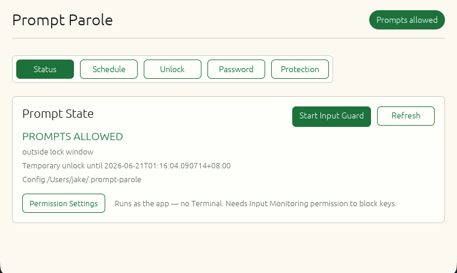

# Prompt Parole

Your AI coding assistant is not the problem. The tenth "one tiny follow-up
prompt" after dinner might be.

Prompt Parole is a Rust curfew gate for Claude Code and Codex. During your
lock window, new prompts are blocked unless the password is entered through the
separate `prompt-parole unlock` command or the local GUI. You can still inspect
files, watch progress, read diffs, and generally look responsible. You just
cannot keep feeding the prompt machine after curfew without parole.

## What It Does

- Blocks Claude Code and Codex prompts during configured hours.
- Adds a macOS Input Guard for already-open terminal sessions (Terminal, iTerm2,
  Ghostty, kitty, WezTerm, Alacritty, Hyper, Tabby): it blocks prompt
  entry/submission keys in focused Codex/Claude windows while leaving output and
  navigation visible. The focused window is matched by title and, as a fallback,
  by inspecting the terminal's process tree for a running agent. (Editors/IDEs
  such as VS Code are intentionally not key-blocked, since that would also block
  editing; use the hook and launcher layers there.)
- Uses `UserPromptSubmit` hooks for prompt-time blocking, so existing output
  and progress stay visible.
- Can install local launch wrappers so new `codex` and `claude` launches are
  rejected during curfew before the agent starts.
- Sets the password once with double entry.
- Changes the password only after the current password is entered.
- Rejects blank passwords, but does not impose a fixed minimum length.
- Saves only a slow password hash, never the password.
- Logs block/unlock events, but does not log prompt text by default.
- Provides a native desktop GUI because editing JSON by hand is how "just
  one more minute" becomes 2:13 AM.

## Install

From a checkout:

```sh
cargo build --release --manifest-path desktop/Cargo.toml
install -m 755 desktop/target/release/prompt-parole "$HOME/.local/bin/prompt-parole"
prompt-parole install-app
prompt-parole install
prompt-parole install-launchers
```

After installing hooks and launchers, restart Claude Code and Codex once so new
sessions use the protected launch path and load the hook command.

Once packaging is added, installation can be made friendlier. For now, the
release binary above is the supported path.

## Desktop GUI



Prompt Parole includes a native Rust desktop app. It is not a browser page, so
Google Password Manager and browser-generated-password prompts are not involved.
The desktop app and CLI are the same Rust binary, which keeps the hook logic and
password hashing in one place. The interface uses a restrained palette drawn
entirely from [Nippon Colors](https://nipponcolors.com/) (Tokiwa, Shironeri,
Gofun, Sumi, Asagi, Yamabuki, Enji, Seiji, Torinoko, Rikyū-nezumi).

Build and run it from the checkout:

```sh
cargo run --manifest-path desktop/Cargo.toml --
```

For a release binary:

```sh
cargo build --release --manifest-path desktop/Cargo.toml
desktop/target/release/prompt-parole
```

To install it as a normal macOS app with the correct **Prompt Parole** app menu
and Finder/Applications identity:

```sh
prompt-parole install-app
open "$HOME/Applications/Prompt Parole.app"
```

The first screen sets the password, default unlock duration, timezone, and
global lock schedule. The schedule applies to both Claude Code and Codex hooks.
Times are selected with start/end dropdowns and day checkboxes; no raw JSON
editing is required. After setup, the same app can save settings, temporarily
unlock prompts, clear a temporary unlock, and change the password.

The "Suggest Local Password" button generates a local password and fills both
new-password boxes. It does not save it anywhere. If the password is forgotten,
Prompt Parole has no recovery command; retrieve it from wherever you stored it,
or the gate will need to be removed outside the app.

## Daily Use

```sh
prompt-parole status
prompt-parole unlock
prompt-parole lock
prompt-parole passwd
prompt-parole configure --lock-window "19:00-05:00 mon,tue,wed,thu,fri,sat,sun"
prompt-parole guard
prompt-parole guard --once --json
prompt-parole guard-agent --action start
prompt-parole guard-agent --action stop
prompt-parole guard-agent --action status
prompt-parole install-app
prompt-parole gui
```

The default lock window is every day from `19:00` to `05:00` in your local time
zone.

`prompt-parole` with no subcommand opens the native GUI. `prompt-parole gui`
does the same thing. Saving settings, changing the password, and temporary
unlocks all require the current password. 

The configured desktop view is tabbed so the window can stay small:
**Status**, **Schedule**, **Unlock**, **Password**, and **Protection**. Use
**Start Input Guard** on the Status tab to block typing into the already-open
Codex/Claude Terminal tab during curfew. Use **Install Hooks & Launchers** on
the Protection tab after entering the current password to protect future
sessions and local `codex`/`claude` commands.

## Config

The generated config looks like this:

```json
{
  "lock_windows": [
    {
      "start": "19:00",
      "end": "05:00",
      "days": ["mon", "tue", "wed", "thu", "fri", "sat", "sun"]
    }
  ],
  "timezone": "local",
  "unlock_duration_minutes": 30,
  "password_required_for": ["configure", "disable", "install", "passwd", "uninstall", "unlock"],
  "log_prompt_text": false
}
```

`unlock`, `passwd`, and `configure` are always password-gated after setup.
`install` and `uninstall` are gated by the config; `disable` also gates
`uninstall`, so the shorter config you suggested can still protect removal.

Lock windows can be written as either:

```text
19:00-05:00
19:00-05:00 mon,tue,wed,thu,fri
```

## Hook Behavior

The installed hook commands are:

```sh
prompt-parole hook --agent claude-code
prompt-parole hook --agent codex
```

When locked, the hook emits:

```json
{"decision":"block","reason":"Prompt Parole: curfew is active until ..."}
```

When allowed, it emits nothing and exits successfully.

The hook is evaluated on every prompt by sessions that loaded and trusted it.
That means a session started at 6:30 PM should block its next prompt after a
7:00 PM curfew while still showing the output that already exists.

Already-running sessions that predate hook installation cannot be retroactively
forced to load a hook by editing a config file. The Input Guard below is the
current-window layer for those sessions: it blocks prompt-entry keys in the
focused Codex/Claude Terminal tab while output remains visible. Reopen Claude
Code or Codex through the protected launcher after installation to add hook and
launcher protection to future sessions too.

Codex also requires non-managed command hooks to be trusted before they run.
Prompt Parole's Codex launcher wrapper starts Codex with hook trust bypass for
that invocation, then the Prompt Parole hook itself makes the allow/block
decision.

## Current-Window Input Guard

`prompt-parole guard` is the layer for the exact "I can watch output but cannot
send another prompt" workflow. On macOS it installs a keyboard event tap and
checks the focused window on each keystroke. When curfew is active and the
focused window is running `codex`, `claude`, or `claude-code` (matched by window
title, or by walking the focused app's process tree), prompt-entry keys are
swallowed before the terminal receives them. The terminal process is not paused,
so output can continue to render. Navigation keys and system shortcuts are left
alone so the session does not feel frozen. If macOS disables the event tap (it
does this on heavy input or a slow callback), the guard re-enables it
immediately so the curfew is not silently dropped.

You may need to grant macOS Accessibility/Input Monitoring permission to the
`prompt-parole` binary the first time the guard starts. If macOS refuses the
event tap, the guard exits with a clear error instead of pretending to protect
the prompt.

For daily use, start the durable macOS LaunchAgent with:

```sh
prompt-parole guard-agent --action start
```

The GUI's **Start Input Guard** button uses the same path. It installs a small
watchdog LaunchAgent plus the keyboard guard. If macOS allows the guard from an
interactive Terminal but denies the direct LaunchAgent event tap, Prompt Parole
falls back to a visible Terminal guard process. During a locked period, the
watchdog restarts that guard if it disappears, so a closed or crashed guard does
not silently reopen prompting.

## Protection Layers

Prompt Parole has three local layers:

1. **Input Guard** blocks prompt-entry keys in the currently focused macOS
   Codex/Claude terminal window during curfew, while output stays visible.
2. **Hooks** block prompt submissions in Claude Code and Codex sessions that have
   loaded and trusted the hook.
3. **Launch wrappers** block new `codex` and `claude` process launches during
   curfew. The wrappers live in `~/.local/bin`, which should appear before
   Homebrew or system binary directories in `PATH`.

This does not intercept hosted web chats or remote surfaces that do not run
through your local Claude/Codex process. It also cannot rewrite a process that
was already running and ignoring hooks. Prompt Parole intentionally does not
pause or kill running agent processes, because that would also stop or hide the
progress you wanted to inspect.

## Security Model

Prompt Parole has no recovery command. If the password is lost, the app will not
unlock itself.

That does not make a local machine into a bank vault. If your operating-system
account can edit your Claude/Codex configs, delete `~/.prompt-parole`, or run
the tools with hook-bypass flags, you can remove the gate. For a stronger
setup, install and protect the hook files from an admin account you do not use
day to day.

In plain language: Prompt Parole can stop a habit. It cannot defeat the person
who owns the laptop and is currently arguing with a shell prompt.

## Verification

```sh
cargo test --manifest-path desktop/Cargo.toml
cargo clippy --manifest-path desktop/Cargo.toml -- -D warnings
cargo build --release --manifest-path desktop/Cargo.toml
prompt-parole status --json
```

## Name

Why "Prompt Parole"? Because the prompts are not banned forever. They are just
required to check in with a responsible adult after hours.
